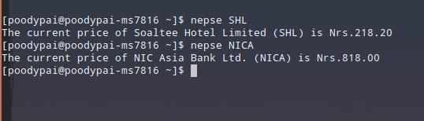

# Nepse Price Checker
---
Check Prices of Stock Listed in Nepal Stock Exchange using Terminal

## Installation
### cURL
```sh
sudo curl -sL "https://raw.githubusercontent.com/poodypai/nepse-price-checker/main/nepse" -o /usr/local/bin/nepse
sudo chmod +x /usr/local/bin/nepse
```
### Requirement
## pup
https://github.com/ericchiang/pup
## Usage
```sh
nepse STOCK_SYMBOL
eg. nepse GBIME

